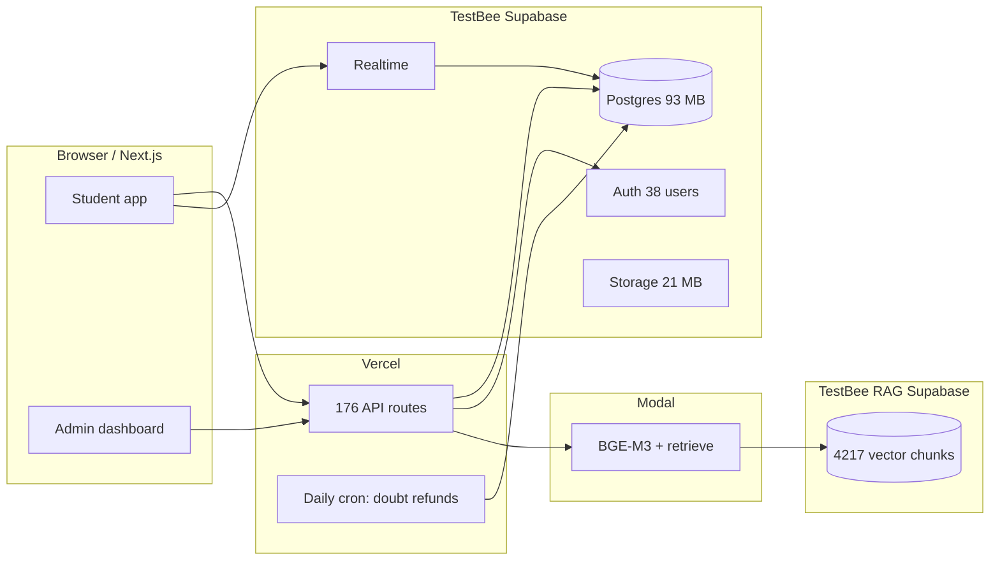
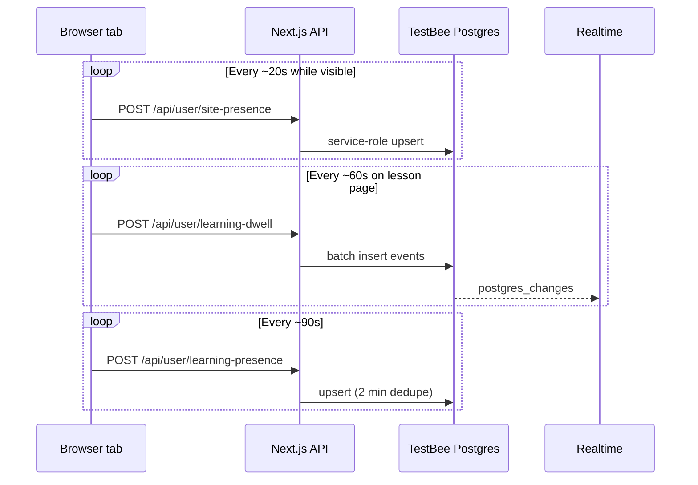

# Supabase Cost & Infrastructure Audit

**Product:** TestBee / EduBlast  
**Audit date:** 11 June 2026  
**Goal:** Find everything that could raise your Supabase bill — now or as you grow — while keeping the product working.

---

## At a glance

| | Main project | RAG project |
|---|-------------|-------------|
| **Name** | TestBee | TestBee RAG |
| **Ref** | `bytsiknhtcnlxwzgqkrd` | `yobzgdsecnutzyvuidqz` |
| **Region** | Tokyo (`ap-northeast-1`) | Tokyo |
| **Database size** | ~93 MB | ~70 MB |
| **Auth users** | 38 | — |
| **Branches** | 1 (`main` only) | — |
| **Edge functions** | 0 | — |

**Codebase footprint:** 250 SQL migrations · 176 API routes · 94 RLS-enabled tables · 4 storage buckets (~21 MB)

**Risk legend:** 🟢 Low · 🟡 Medium · 🔴 High · ⚫ Critical at scale

---

## 1. Executive summary

### What is using Supabase today

Your bill is driven by **two separate Supabase projects**, a **busy telemetry layer** (presence and dwell tracking), **Realtime subscriptions** on profile and buddy screens, and a **large schema** with many RLS policies and triggers.



| Area | What happens | Cost driver |
|------|----------------|-------------|
| **Two projects** | App data on main; textbook search on RAG | **Two monthly compute bills** |
| **Telemetry** | Heartbeats every 20–90 seconds while students browse | **DB writes scale with active time** |
| **Realtime** | Profile + buddy views subscribe to several tables | **Connections + message volume** |
| **RAG** | Up to 3 vector searches per Gyan answer | **RAG project CPU per question** |
| **AI logging** | Every LLM call → `ai_token_logs` (12k+ rows) | **Storage + slow admin queries** |
| **Storage** | Marksheets, avatars, teacher docs | Low today (~21 MB) |

### What could surprise you later

1. **Active students, not total signups** — presence and dwell fire continuously while someone has a tab open.
2. **The RAG project** — fixed compute even when traffic is quiet.
3. **RLS performance debt** — 181 advisor warnings; fine at 38 users, expensive at thousands.
4. **Gyan bot cron** — code exists for every-10-minute AI posts; **not** in `vercel.json` today, but one config change away.
5. **Pro + custom domain** — `auth.edublast.in` needs Pro and the Custom Domains add-on ([runbook](../cursor/supabase-auth-custom-domain-step1.md)).

### Top 10 cost risks

| # | Risk | Level |
|---|------|-------|
| 1 | Two Supabase projects (main + RAG) | 🔴 |
| 2 | Presence / dwell telemetry at scale | 🔴 |
| 3 | 181 RLS `auth_rls_initplan` warnings | 🔴 |
| 4 | RAG multi-pass vector search (up to 3× per question) | 🟡–🔴 |
| 5 | Realtime subscription sprawl (profile, buddy, dashboard) | 🟡–🔴 |
| 6 | Heavy service-role usage from Vercel (connection pressure) | 🟡 |
| 7 | Unbounded `ai_token_logs`, `student_events`, dwell tables | 🟡 |
| 8 | Gyan bot cron if enabled without review | 🟡 |
| 9 | Pro plan + Custom Domains for OAuth branding | 🟡 (fixed add-on) |
| 10 | Growing MCQ bank + `subtopic_content` (36 MB) | 🟢–🟡 |

---

## 2. Supabase cost audit (by product area)

Each row: **risk today → why → impact → what to do**.

### Database compute

| | |
|---|---|
| **Risk** | 🟡 now · 🔴 at scale |
| **Why** | 94 RLS tables, JSONB-heavy `profiles`, admin RPCs that scan whole tables. Performance advisor: **181 WARN** (`auth_rls_initplan`), **17** duplicate permissive policies, **89** unused indexes. |
| **Impact** | Negligible at 38 users. Noticeable CPU when feeds, profile, and admin analytics run under load. |
| **Fix** | Use `(select auth.uid())` in RLS; merge duplicate policies; drop verified-unused indexes; cache admin analytics. |

### Branching & preview environments

| | |
|---|---|
| **Risk** | 🟢 |
| **Why** | Only one branch: `main`. No CI-created preview databases. |
| **Impact** | No extra branch compute today. |
| **Fix** | If you enable branching later: auto-delete after 3–7 days; never leave idle persistent branches. |

### Storage

| | |
|---|---|
| **Risk** | 🟢 |
| **Why** | 22 objects, ~21 MB. Buckets: `academic-marksheets`, `achievement-marksheets`, `profile-avatars` (public), `teacher-verification-docs`. Per-file caps 5–10 MB. |
| **Impact** | Low until many marksheet uploads. |
| **Fix** | Client-side image compression; lifecycle cleanup for abandoned uploads. |

### Bandwidth / egress

| | |
|---|---|
| **Risk** | 🟡 at scale |
| **Why** | Large reads: `subtopic_content`, `mock_questions`, classroom feeds with joins. `supabaseNodeFetch` allows up to **2 retries** and **120s** body timeout — failed calls can triple traffic. |
| **Impact** | Grows with concurrent students and unpaginated lists. |
| **Fix** | Paginate feeds; cache MCQ chapter previews; set `SUPABASE_FETCH_RETRIES=1` in production. |

### Realtime

| | |
|---|---|
| **Risk** | 🟡–🔴 at scale |
| **Why** | Multiple `postgres_changes` channels per screen (profile: 3+; buddy: 4 tables). |
| **Impact** | Billed per connections and messages; each open profile/buddy session multiplies load. |
| **Fix** | Fewer channels; unsubscribe when tab hidden; poll for low-frequency data. |

**Key files:** `components/profile/StudentProfileHubPanels.tsx`, `hooks/useBuddyDashboardLive.ts`, `components/dashboard/StudentHomeDashboard.tsx`

### Authentication

| | |
|---|---|
| **Risk** | 🟢 (38 MAU) |
| **Why** | Google OAuth; middleware session refresh. `useAuth.tsx` correctly **skips profile refetch on token refresh**. |
| **Impact** | MAU pricing matters at thousands of users. Custom domain adds fixed Pro cost. |
| **Fix** | Enable custom domain only when Pro is justified. |

### Edge functions

| | |
|---|---|
| **Risk** | 🟢 ($0) |
| **Why** | None deployed. Logic lives in Next.js API routes + Modal. |
| **Fix** | No change needed unless you have a specific edge-latency case. |

### Scheduled jobs

| | |
|---|---|
| **Risk** | 🟡 |
| **Why** | `pg_cron` **not installed** on production. Only one Vercel cron today: daily doubt bounty refunds. Archive-sections and Gyan-bot crons exist in code but are **not scheduled**. |
| **Impact** | Expired classroom sections may never archive; Gyan bot safe until someone adds it to `vercel.json`. |
| **Fix** | Add `archive-classroom-sections` to `vercel.json`. Add Gyan bot only with `CRON_SECRET` and a conservative interval. |

**Current `vercel.json`:**

```json
{
  "crons": [
    { "path": "/api/cron/refund-doubt-bounties", "schedule": "0 0 * * *" }
  ]
}
```

### Triggers & functions

| | |
|---|---|
| **Risk** | 🟡 |
| **Why** | Many SECURITY DEFINER RPCs and triggers (RDM, doubts, streaks, classroom membership). |
| **Impact** | Extra CPU per insert/update on hot tables. |
| **Fix** | Audit write-heavy paths; avoid recursive trigger chains. |

### Replication, logs, backups

| Area | Risk | Notes |
|------|------|-------|
| Read replicas | 🟢 | Not configured — good unless you need them |
| Logs | 🟢–🟡 | Plan-dependent retention; app also writes `ai_token_logs` |
| Backups | 🟢 | Small DB; PITR is a paid add-on if you need point-in-time recovery |

### Connection pooling

| | |
|---|---|
| **Risk** | 🟡 |
| **Why** | Local config has pooler off. Vercel serverless opens many short-lived connections. Advisor: 1× `auth_db_connections_absolute` warning. |
| **Fix** | Use **Supavisor** transaction mode for serverless workloads. |

### Vector / embeddings

| | |
|---|---|
| **Risk** | 🟡 (RAG project) |
| **Why** | RAG: **4,217** `textbook_chunks` (~59 MB). Main: `episodic_memory` + HNSW index ready but **0 rows**. |
| **Fix** | Right-size RAG tier; cap `match_count`; consider single-project architecture long term. |

### AI workloads (logged in Supabase)

| | |
|---|---|
| **Risk** | 🟡 |
| **Why** | `ai_token_logs`: **12,202** rows. Topic generation writes large JSON to `subtopic_content` (36 MB table). LLM spend itself is Sarvam/Gemini/Modal — not Supabase. |
| **Fix** | Retention policy on logs; dedupe topic generation. |

### Background workers

| | |
|---|---|
| **Risk** | Modal (external) |
| **Why** | Modal RAG deploys via `.github/workflows/deploy-rag.yml`; each `/retrieve` hits RAG Supabase. |
| **Fix** | Modal concurrency limits; optional RAG response cache. |

---

## 3. Database analysis

### Largest tables (main project)

| Table | ~Rows | Size | Role |
|-------|------:|-----:|------|
| `subtopic_content` | 1,853 | **36 MB** | AI-generated lesson JSON |
| `mock_questions` | 9,250 | 12 MB | CBSE Class 11/12 MCQs |
| `ai_token_logs` | 12,202 | 8.3 MB | Per-call AI audit trail |
| `topic_content_runs` | 1,033 | 5.5 MB | Generation runs |
| `topic_content` | 626 | 3.7 MB | Topic hub content |
| `student_events` | 2,585 | 1.6 MB | Product analytics |
| `student_learning_dwell_events` | 1,333 | 784 KB | Lesson time samples |

**Total main DB:** ~93 MB · **RAG DB:** ~70 MB (mostly `textbook_chunks`)

### Indexes & advisor findings

| Finding | Count | Effect |
|---------|------:|--------|
| `auth_rls_initplan` | 181 | `auth.uid()` re-evaluated per row — CPU grows with table size |
| Unused indexes | 89 | Slower writes, wasted disk |
| Unindexed foreign keys | 41 | Slower joins and deletes |
| Multiple permissive policies | 17 | Extra policy work per query |

### Expensive patterns (with code)

**1. Penalty reconcile on every study-day fetch**

```typescript
// app/api/user/study-days/route.ts
const { data, error: reconcileError } = await sb.rpc("reconcile_inactive_day_penalties");
```

Runs unless `?reconcile=0`. Dashboard visits should not all trigger this.

**2. RAG: up to three vector RPCs per question**

```python
# modal-rag/retriever.py — Pass 1 → Pass 2 (all subjects) → Pass 3 (all grades)
chunks = await _call_match_chunks(embedding, grade_level, mapped_subject, match_count)
# ... fallback passes when similarity is low
```

**3. Admin analytics full scan**

`admin_analytics_summary()` in `supabase/migrations/20260612100000_admin_analytics_rpc.sql` aggregates across `profiles` JSONB, `doubts`, and `ai_token_logs`.

**4. Classroom feed without pagination**

`components/ClassFeed.tsx` loads all posts for a classroom in one query.

### RLS & triggers

- **94** tables with RLS — recent fixes for `posts` recursion (`20260806130000`, `20260806140000`).
- Triggers on RDM, doubts escrow, section history, new-user profiles — expect write amplification on hot paths.

---

## 4. Branching analysis

| Question | Answer |
|----------|--------|
| Supabase branches today? | **One:** `main` only |
| Preview branch compute? | **None** |
| CI-created DB branches? | **None** in repo |
| Git branch `gyan++changes-4`? | App code only — no linked Supabase preview |

**Retention policy (recommended):** If you enable Supabase branching for PRs, delete branches within **3–7 days** of merge. Do not use `persistent: true` for throwaway previews.

---

## 5. Backend cost analysis

### Telemetry flow (main scale risk)



| Endpoint | Approx. frequency | Notes |
|----------|-------------------|--------|
| `POST /api/user/site-presence` | ~every **20s** / active tab | Service role |
| `POST /api/user/learning-dwell` | ~every **60s** / lesson | Up to 25 events per batch |
| `POST /api/user/learning-presence` | ~every **90s** | Skips if same place &lt; 2 min |
| `GET /api/user/study-days` | Dashboard + Realtime | Runs reconcile RPC by default |
| `GET /api/buddy/dashboard` | 20s–5 min + Realtime | Multi-table read |

**Rough scale math:** One student with one visible tab ≈ **180 presence writes/hour** before dwell events. At 500 concurrent students that is **90,000+ writes/hour** from presence alone.

### Cron jobs

| Job | Scheduled? | Route |
|-----|------------|-------|
| Refund expired doubt bounties | ✅ Daily (`vercel.json`) | `/api/cron/refund-doubt-bounties` |
| Archive expired classroom sections | ❌ | `/api/cron/archive-classroom-sections` |
| Gyan bot auto-posts | ❌ | `/api/cron/gyan-bot-post` |

`pg_cron` migrations exist but extension is **not enabled** — production relies on Vercel (or manual calls).

### Gyan bot (dormant but dangerous)

Default interval in DB config: **10 minutes**. Each cycle can create a doubt + Sarvam answer + optional RAG + verify.

```typescript
// lib/gyan/bot/gyanBotPostCycle.ts
const intervalMs = Math.max(1, cfg.interval_minutes ?? 10) * 60_000;
```

Protected in production by missing `CRON_SECRET` on the route — but **not scheduled** in `vercel.json` today.

### Service role & retries

- **Many** API routes use `createAdminClient()` (grep: admin client across `app/api/`) — bypasses RLS; increases connection count from Vercel.
- `lib/supabase/supabaseNodeFetch.ts`: default **2 retries** on network failure → up to 3× Supabase calls per logical request.

---

## 6. Frontend analysis

### What already helps

| Pattern | Where |
|---------|--------|
| Skip profile refetch on token refresh | `hooks/useAuth.tsx` |
| 2 min dedupe on learning presence | `app/api/user/learning-presence/route.ts` |
| 20s dedupe on site presence | `app/api/user/site-presence/route.ts` |
| 60s batched dwell flush | `hooks/useLearningDwellTelemetry.ts` |
| Unsubscribe Gyan Realtime when tab hidden | `StudentProfileHubPanels.tsx` |

### What still costs

| Pattern | Where | Issue |
|---------|--------|--------|
| One Realtime event → **4 API reloads** | `StudentProfileHubPanels.tsx` | study days, attendance, learning, Gyan+ |
| Buddy: **4 Realtime tables** + 20s poll | `useBuddyDashboardLive.ts` | Heavy when panel open |
| **12s** onboarding polls | `refer-earn/page.tsx` | Repeated status checks |
| Task progress poll **120s** | `AssignmentTaskChecklist.tsx` | Acceptable; still steady load |

### Realtime example (profile)

```typescript
// components/profile/StudentProfileHubPanels.tsx
.on("postgres_changes", { table: "user_study_day_totals", ... }, () => {
  void loadStudyDays();
  void loadAttendanceStats();
  void loadLearningActivity();
  void loadGyanPlusEngagement();
})
```

One row change triggers four downstream loads.

---

## 7. AI & vector cost analysis

### Architecture

| Component | Bills to | Notes |
|-----------|----------|-------|
| BGE-M3 embeddings | **Modal** | Loaded at container start |
| `match_chunks` RPC | **TestBee RAG** Supabase | Up to 3 calls per retrieve |
| Sarvam / Gemini | **External APIs** | Logged to `ai_token_logs` |
| `episodic_memory` on main | **Main Supabase** | Schema ready, **0 rows** |

### RAG match counts

| Use case | `match_count` | File |
|----------|---------------|------|
| Default chat / Gyan | 5–8 | `lib/rag.ts`, `lib/gyan/rag.ts` |
| Topic intermediate | 15 | `app/api/agent/generate-topic/route.ts` |
| Topic advanced | **25** | same |

Topic generation may call RAG **multiple times** per run — highest Supabase vector load in the app.

### Duplicate / optional AI work

- `PROF_PI_VERIFY=1` → second Sarvam pass per answer (env flag).
- `ai_token_logs` grows without retention.
- `episodic_memory` unused — no cost yet, but HNSW index reserved.

---

## 8. Memory & compute risk map

| Source | Symptom | Severity |
|--------|---------|----------|
| `SitePresenceProvider.tsx` | 1s timer + 20s heartbeat | ⚫ at scale |
| `useLearningDwellTelemetry.ts` | 60s flush + 90s presence | 🔴 |
| `StudentProfileHubPanels.tsx` | 3 Realtime channels, 4 loaders/event | 🟡–🔴 |
| `useBuddyDashboardLive.ts` | 4 Realtime + 20s/5min polls | 🟡 |
| `admin_analytics_summary` | Full-table admin RPC | 🟡 (admin-only) |
| `subtopic_content` 36 MB | Large JSON rows | 🟡 |
| `profiles` JSONB aggregates | Admin RPC walks keys per profile | 🟡 at user growth |
| Modal BGE-M3 | RAM on cold start | External (Modal) |

---

## 9. Future billing scenarios (ranked)

| Rank | If this happens… | Risk |
|------|------------------|------|
| 1 | 1,000+ students with presence + dwell on | ⚫ |
| 2 | Both Supabase projects stay on paid tiers | 🔴 |
| 3 | Gyan bot cron at 10 min in production | 🔴 |
| 4 | Pro + Custom Domains for `auth.edublast.in` | 🔴 (fixed) |
| 5 | RLS not fixed → forced compute upgrade | 🔴 |
| 6 | Realtime on every profile visit | 🟡–🔴 |
| 7 | More MCQ / content imports | 🟡 |
| 8 | Log tables reach GB without retention | 🟡 |
| 9 | Supabase preview branch per PR | 🟡 |
| 10 | Marksheet storage at scale | 🟢–🟡 |

---

## 10. Action plan

### Do today

| # | Action | Why | Est. savings | Touch |
|---|--------|-----|--------------|-------|
| 1 | Add `archive-classroom-sections` to `vercel.json` | Sections never archive otherwise | Prevents silent bloat | `vercel.json` |
| 2 | Confirm Gyan bot **not** in Vercel crons | 144 AI cycles/day if enabled | Large if misconfigured | Vercel dashboard |
| 3 | Review RAG project tier / pause if idle | Second compute bill | Check plan in Supabase dashboard | Supabase dashboard |
| 4 | Set `SUPABASE_FETCH_RETRIES=1` in prod | Fewer retry storms | Medium on bad networks | Vercel env |

### This week

| # | Action | Why | Est. savings | Touch |
|---|--------|-----|--------------|-------|
| 5 | `?reconcile=0` on routine study-day reads; reconcile once/IST day | Stops RPC every dashboard poll | **High CPU** at scale | `lib/dashboard/studyDaysClient.ts` |
| 6 | Fix RLS initplan on hottest tables | 181 advisor warnings | **High CPU** at scale | New migration |
| 7 | Drop verified-unused indexes | 89 flagged | Faster writes | Migration after `pg_stat_user_indexes` review |
| 8 | Retention: `ai_token_logs` &gt;90d, dwell &gt;180d | Unbounded growth | Storage + admin speed | Cron + SQL |
| 9 | Presence heartbeat **45–60s** (from 20s) | ~50–66% fewer presence writes | **High** at scale | `SitePresenceProvider.tsx`, `site-presence/route.ts` |
| 10 | Debounce profile Realtime loaders | 4× API per DB event | Medium egress | `StudentProfileHubPanels.tsx` |
| 11 | Cap chat RAG `match_count` at 5 | Fewer vector RPCs | Medium on RAG | `lib/gyan/rag.ts` |
| 12 | Enable **Supavisor** for serverless | Connection limits | Avoid tier bump | Supabase + env |

### Long term

| # | Action | Why |
|---|--------|-----|
| 13 | Merge RAG into main **or** external vector store | One compute bill |
| 14 | Redis/Upstash for presence, flush to Postgres every 5 min | Biggest scale win |
| 15 | Materialized views for admin analytics | Cheaper admin dashboard |
| 16 | Paginate classroom feeds + MCQ previews | Less egress |
| 17 | Partition `student_learning_dwell_events` by month | Time-series at scale |
| 18 | Defer Pro + custom domain until revenue covers it | Fixed add-on cost |

---

## Hidden risks (easy to miss)

1. **Telemetry feels free** — it will likely beat auth and storage in your Supabase bill as you grow.
2. **Service role for student presence** — every heartbeat uses admin client instead of a tight RLS upsert.
3. **RAG fallback** — weak queries still run up to 3 vector searches.
4. **Gyan bot** — one `vercel.json` entry from 24/7 AI spend.
5. **Two projects in one org** — easy to forget the RAG line item when downsizing.
6. **`pg_cron` migrations no-op** — extension not enabled; schedules depend on Vercel.
7. **89 unused indexes** — every dwell/play insert maintains indexes you never read.

---

## File index

| Topic | Path |
|-------|------|
| Supabase local config | `supabase/config.toml` |
| Migrations | `supabase/migrations/` |
| Server clients | `integrations/supabase/server.ts` |
| Fetch retries | `lib/supabase/supabaseNodeFetch.ts` |
| Vercel crons | `vercel.json` |
| Cron routes | `app/api/cron/` |
| Site presence | `components/providers/SitePresenceProvider.tsx`, `app/api/user/site-presence/route.ts` |
| Learning dwell | `hooks/useLearningDwellTelemetry.ts`, `app/api/user/learning-dwell/route.ts` |
| Study days + reconcile | `app/api/user/study-days/route.ts` |
| Profile Realtime | `components/profile/StudentProfileHubPanels.tsx` |
| Buddy live | `hooks/useBuddyDashboardLive.ts` |
| RAG retriever | `modal-rag/retriever.py` |
| Episodic memory schema | `supabase/migrations/20260415120000_rag_memory_schema.sql` |
| Admin analytics RPC | `supabase/migrations/20260612100000_admin_analytics_rpc.sql` |
| Gyan bot cycle | `lib/gyan/bot/gyanBotPostCycle.ts`, `app/api/cron/gyan-bot-post/route.ts` |
| Custom domain runbook | `docs/cursor/supabase-auth-custom-domain-step1.md` |
| Modal CI | `.github/workflows/deploy-rag.yml` |

---

## Bottom line

At **38 users**, you are paying primarily for **two Supabase compute instances** (main + RAG), not storage. The largest **future** risk is **per-session telemetry and Realtime** scaling linearly with active students, compounded by **RLS initplan debt** if user count grows before it is fixed.

**Before a growth push:** slow down presence heartbeats, dedupe study-day reconcile, and fix the top RLS policies. **Before enabling new crons:** treat Gyan bot as a budgeted AI product feature, not a background task.

---

## Methodology & confidence

| Source | What it covers |
|--------|----------------|
| **Live Supabase** (MCP, 11 Jun 2026) | Project refs, DB sizes, `auth.users` count, table sizes/row counts, storage, branches, extensions, edge functions, performance/security advisors |
| **Repo** | `vercel.json`, API routes, telemetry intervals, RAG retriever, cron route files, migrations |
| **Calculated** | Presence writes/hour (from documented intervals) — illustrative, not measured traffic |
| **Not in scope** | Actual invoice, plan tier, Vercel dashboard crons beyond `vercel.json` |

Table row counts from `pg_stat_user_tables` are estimates; exact figures (e.g. RAG **4,217** chunks) used `COUNT(*)`. Risk rankings are engineering judgment from the above, not Supabase billing meters.

---

*Generated from codebase review + live Supabase project inspection (11 Jun 2026). Re-run after major schema changes or before launch campaigns.*
