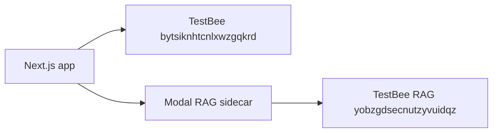

# Phase 4 — Infrastructure & billing (Option A)

**Status:** Complete 2026-06-11 — **keep TestBee RAG as a separate Supabase project** (do not merge, pause, or migrate).

**Decision owner:** Product — RAG isolation is intentional for reliability.

---

## Architecture decision (locked)

| Option | Choice | Rationale |
|--------|--------|-----------|
| **A — Keep separate** | **Selected** | Textbook vector DB stays isolated from app DB; Modal retriever unchanged; no migration risk to Gyan+ Q&A |
| B — Merge into main | Rejected | Would cancel second bill but touches production RAG path |
| C — External vector store | Deferred | Not needed at current scale |

### Two projects (permanent)

| Project | Ref | Role | Agent rule |
|---------|-----|------|------------|
| **TestBee** (main) | `bytsiknhtcnlxwzgqkrd` | Auth, app data, Realtime, storage | Normal migrations + app code |
| **TestBee RAG** | `yobzgdsecnutzyvuidqz` | `textbook_chunks` + `match_chunks` only | **Do not** merge, pause, delete, or point main app env at this ref |

**RAG touchpoints (read-only for cost work):**

| Layer | Config |
|-------|--------|
| Modal secret `custom-secret` | `RAG_SUPABASE_URL`, `RAG_SUPABASE_ANON_KEY` → **RAG project only** |
| Retriever | `modal-rag/retriever.py` → `match_chunks` on RAG DB |
| Next.js | `RAG_SIDECAR_URL` → Modal only (never main Supabase for textbook chunks) |

**Cost control without touching RAG project:** Phase 1 capped `match_count` and skip multi-pass when Pass 1 is good (`modal-rag/retriever.py` — redeploy Modal after changes).

---

## Monthly billing checklist (you — dashboard)

Fill in once per quarter or before a growth push:

| Line item | Project | Plan tier | ~$/month | Notes |
|-----------|---------|-----------|----------|-------|
| Main compute | `bytsiknhtcnlxwzgqkrd` | _fill in_ | _fill in_ | ~93 MB DB, 38 auth users |
| RAG compute | `yobzgdsecnutzyvuidqz` | _fill in_ | _fill in_ | ~70 MB, 4217 chunks — **keep active** |
| Pro + Custom Domains | main | Deferred | — | See below |
| Supabase branches | main | `main` only today | $0 extra | Policy below |
| Modal RAG | external | Modal dashboard | separate bill | Not Supabase |

Dashboard links:

- Main: `https://supabase.com/dashboard/project/bytsiknhtcnlxwzgqkrd`
- RAG: `https://supabase.com/dashboard/project/yobzgdsecnutzyvuidqz`

---

## Pro + `auth.edublast.in` — deferred

OAuth branding (`auth.edublast.in` instead of `*.supabase.co` on Google sign-in) requires **Supabase Pro + Custom Domains add-on** (fixed monthly cost).

| Status | Action |
|--------|--------|
| **Deferred** | Enable when revenue covers the add-on |
| Runbook when ready | `docs/cursor/supabase-auth-custom-domain-step1.md` |

No code or DNS changes until you explicitly approve.

---

## Supabase branch policy

| Rule | Why |
|------|-----|
| **Do not** enable preview DB branches per PR unless needed | Each branch = extra compute |
| If enabled: delete within **3–7 days** of merge | Avoid orphan branch bills |
| **Never** `persistent: true` for throwaway previews | Audit recommendation |
| Git branch `gyan++changes-4` | App code only — no linked Supabase preview today |

---

## Production env (Vercel — you)

| Variable | Recommended | Why |
|----------|-------------|-----|
| `SUPABASE_FETCH_RETRIES` | `1` | Fewer retry storms on flaky networks (default in code is `2`) |
| `CRON_SECRET` | Set if you re-add crons | Phase 0 — crons still manual-only |
| `RAG_SUPABASE_*` | **Modal secrets only** | Not on Vercel; stays on RAG project |

Main app env must keep `NEXT_PUBLIC_SUPABASE_URL` → **main** project only.

---

## Verify (no RAG project changes)

1. Ask a Gyan+ / subject-chat question → `[RAG] Enriched prompt with N passages` in logs.
2. Modal `custom-secret`: `RAG_SUPABASE_URL` host contains `yobzgdsecnutzyvuidqz`.
3. Main `.env` / Vercel: `NEXT_PUBLIC_SUPABASE_URL` host contains `bytsiknhtcnlxwzgqkrd` only.
4. Supabase dashboard → both projects show **active** (not paused).

---

## Not in Phase 4

| Item | Phase |
|------|-------|
| Merge / pause / delete RAG project | **Out of scope** (Option A) |
| Redis presence | Phase 5 |
| Topic hub UX | Phase 6 |

---

## Related runbooks

| Phase | Doc |
|-------|-----|
| 0 | `supabase-cost-phase0-crons.md` |
| 1 | `supabase-cost-phase1-quick-wins.md` |
| 2 | `supabase-cost-phase2-db-hygiene.md` |
| 3 | `supabase-cost-phase3-connections-realtime.md` |
| Audit | `supabase-cost-audit-2026-06-11.md` |
